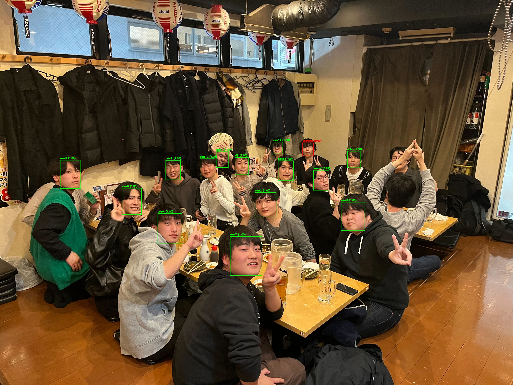

# 顔認証システム

@UnaNancyOwen(Tsukasa Sugiura)氏のプログラムを参考にして顔認証システムを作成した。

URL: [OpenCVの新しい顔認識を試してみる](https://qiita.com/UnaNancyOwen/items/8c65a976b0da2a558f06)

## 顔検出・認識
OpenCV 4.5.4から新しく実装された顔検出/顔認識のAPIを用いている。
* cv::FaceDetectorYN ... YuNetによる顔とランドマークの検出
* cv::FaceRecognizerSF ... SFaceによる顔の認識

## プログラムの構成
プログラムは3段階で構成されている。

1. generate_aligned_faces.py ... 画像から顔を検出して切り出し、顔画像として保存する
2. generate_feature.py ... 顔画像から特徴を抽出、特徴辞書として保存する
3. face_recognizer.py ... 入力画像から顔を検出し特徴を抽出、特徴辞書と比較して顔認識する

### generate_aligned_faces.py の動作
1. input_img から画像を読みこむ
2. YuNetによる顔の検出
3. 顔を切り抜く
4. output_face_img に画像を保存する

#### 顔の切り抜き

顔の検出結果から顔領域を切り抜きます。このとき目・鼻・口の位置が一定になるように正規化され、どの顔も同じ大きさになります。  
cv2.FaceRecognizerSF.alignCrop()に顔を検出した元画像と顔の検出結果を入力します。
ここではcv2.FaceDetectorYN.detect()の結果をそのまま入力します。他の顔検出手法の結果を入力したい場合は、顔の検出結果をcv2.FaceDetectorYN.detect()の出力フォーマットに合わせるか、自分で正規化した顔画像を生成する必要があることに注意してください。
戻り値は正規化された顔画像です。ランドマークの位置が一定になるようにアフィン変換された顔が112x112のサイズで出されます。

```
# 検出された顔を切り抜く
aligned_faces = []
if faces is not None:
    print(f"aligned {len(faces)} faces")
    for face in faces:
        aligned_face = face_recognizer.alignCrop(image, face)
        aligned_faces.append(aligned_face)
else:
    print(f"no face")
```

切り抜かれた画像は SFace を用いた顔の識別に正解データとして利用する。

画像は手動で data/face_fig フォルダ へ以下のように格納する。

```
face_fig
    ├─user1
    │  └─image*.jpg
    ├─user2
    │  └─image*.jpg
    ├─user3
    │  └─image*.jpg
    ├─user4
    │  └─image*.jpg
    └─user5
       └─image*.jpg

```
user1,user2 などのディレクトリ名はのちに history.db の入力に用いられる。


### generate_feature.py の動作
1. face_fig より .jpg ファイルを選択
2. 特徴量を抽出
3. 特徴量を .npy で保存

SFace を用いて特徴量を抽出する
```
# 特徴を抽出する
face_feature = face_recognizer.feature(aligned_face)
```

入力された .jpg ファイルから拡張子のみを変更して保存する。
```
dir_path = os.path.join(".\\data","face_fig")

# ディレクトリに含まれるすべての.jpgファイル
files = glob.glob(os.path.join(dir_path, "**", "*.jpg"), recursive=True)

for file in files:
    print(file)
    # .jpgから特徴点をnpで計算
    face_feature = features_detection(file)

    dictionary = os.path.splitext(os.path.dirname(file))[0]
    basename = os.path.splitext(os.path.basename(file))[0]
    save_path = os.path.join(dictionary, f"{basename}.npy")

    # 同ファイル名で.npyファイルを保存
    np.save(save_path, face_feature)
```


### face_recognizer.py の動作
1. 入力画像から顔の検出
2. 顔より特徴点を抽出
3. face_fig に保存された特徴量と比較し識別する
4. 識別された顔の名前をdbに書き込み

検出された顔の特徴量と face_fig に保存された特徴量と比較する
```
score = recognizer.match(feature1, feature2, cv2.FaceRecognizerSF_FR_COSINE)
```
最もスコアが大きくなるファイルを選択する
```
if score > max_score:
    max_score = score
    max_user = user_id
```
スコアが COSINE_THRESHOLD の値より小さければ不明な人物として処理する
```
if max_score < COSINE_THRESHOLD:
    return False, ("", 0.0)
```
<br>
<br>
sql_updater 関数を用いて検出されたユーザーを history.db に保存する。

日付でテーブルを作成する
```
# テーブルが存在しなければ作成
cur.execute(f"CREATE TABLE IF NOT EXISTS '{d_today}'(min INTEGER PRIMARY KEY);")
conn.commit()
```

テーブルのカラムは2種類ある
* min [INTEGER PRIMARY KEY] ... 分単位で記録する
* user_name [TEXT] ... ユーザーの検出結果を True or False で記録


## 実行結果
入力画像

検出後


data/face_fig に存在するユーザーが検出された画像より識別されていることが分かる

存在しないユーザーはUnknownとして処理されている

### 問題点・改善点
本プログラムはcv2より1フレームごとに人物を検出しているため、たまたま誤検知された場合であっても記録されてしまう問題点がある。　　

face_recognizer.pyはプログラムを書き換えることによりcv2への入力方法を変更できる。

cv2への入力方法は以下のようなものがあるが、実行文の引数をパースにすることで便利な使い方が出来る
* jepg形式の画像
* mp4などの動画
* カメラ

※ラズパイなどからストリーミング配信されている映像をcv2に入力する方法があり、この場合は以下のような形で入力できる。
```
URL = "配信されているURL"
cv2(URL)
```

